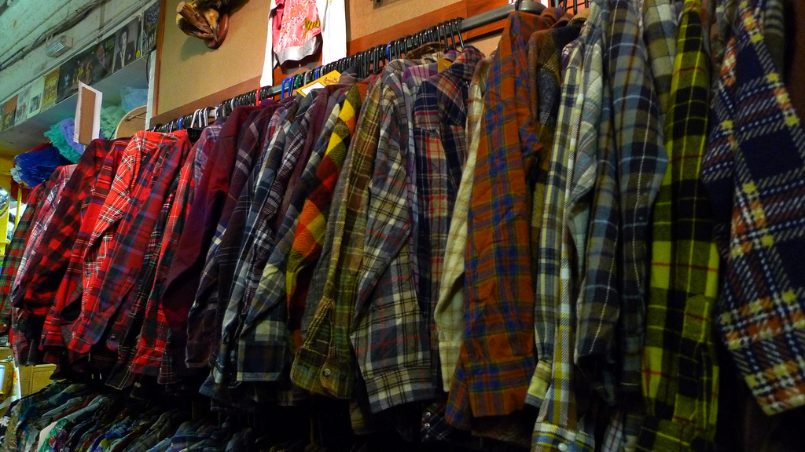

# Product Classifier

 

**Classify products into categories by their name with NLTK**

## Introduction

In order to reason about the similarity of products, particularly in the genre of apparel, a useful first step is to classify the products according to some hierarchical categorization scheme. These categories serve to group semantic features that can be used for ontological analysis later on as well as providing an initial framework for both functional and physical attributes (e.g. tops have sleeves, and coats are for use in cold weather). Unfortunately, no one standardized scheme exists for the genre (unlike movies) and we cannot rely on the ingestion of structured data from a variety of sources (e.g. affiliate data or web crawl data). Instead some algorithmic approach is required.

Luckily, we do have a significant amount of information about products that we can acquire reliably via ingestion from any source. In particular, the product name and description are usually available and seem to be enough for a human annotator to decide on a category for the product. Additionally we may have fields relating to the size, color, or even keywords used for quick search – all data features that may be used to enhance or develop a statistical classification approach using machine learning methodologies. This type of information lends itself immediately to probabilistic language model-based classification methods, which we will explore in this project.

Statistical learning algorithms are characterized by some underlying probability model and whose output is not just a classifier, but also a probability that the instance belongs in that class. In this project, we will focus in particular on supervised machine learning algorithms, which statisticians typically call classification, vs. unsupervised machine learning, which is usually called clustering. In order to perform supervised classification we require some annotated corpus of correct answers with which to train our model. This annotated corpus is used to create some hypothetical probability distribution across a feature set, which is then used to predict future outcomes. The classifiers themselves are some set of predetermined labels that we can then use to broadly generalize an instance, given its unique set of features.

## Methodology

The schema of most apparel data notably includes several string fields that we have identified as extremely useful in characterizing a product- particularly by human annotators. In particular the name of the product is extremely descriptive in apparel because it is a distinguishing marketing feature that encodes unique attributes of a product for consumers. Consider the difference between an apparel product name and a movie title: “Obey ‘Anchors’ Shawl Cardigan Burgundy X-Large” vs. “Gone with the Wind”. Movie titles attempt to be short, memorable titles that are extremely unique to convey some artistic meaning to the reader. However, these titles do not contain enough information to classify them into genre.

Product names on the other hand do tend to capture classification information, possibly even including size and color information, which can aid in the classification. Consider that shoe sizes are numbers from 4-13 whereas a shirt size can be described as S, M, L, or XL. These tokens will assist in differentiating the vector space, although not fully considering that dresses seem to be sized similarly as shoes (although you can have a size 0 dress but not a size 0 shoe), and pants can be described either by the waist and inseam, or as in the case of athletic pants using the same S, M, L, or XL tokens.

Other useful text fields include the description of the product, a short, usually grammatical description of the product with even more fine grain detail, and search keywords for example: “Men, Shoes, Athletic”. Other data points could include the merchant name, extracted size and color characterizations, potentially even price or sale price. However, for the purposes of this article we focus on the name, description, and keywords fields.

Another consideration in the evaluation of a classifier is their performance given a minimum amount of information, and we would like to ensure that we use the most lightweight model possible. Whereas the product name will always be available, descriptions or keywords might be limited depending on the data source. We would like to achieve a model capable of highly accurate classifications using, if possible, the name only.

## Notes

This project utilizes NTLK and a Maximum Entropy model to build a classifier which can then be used as a data product in production. The data set used to train the classifier is propriertary, however a pickle containing the parameterization of the model is compressed in the `fixtures` folder. In the future, we will acquire a public data set to use and expand upon this project.

### Attribution

The image used in this README, [Too Much Plaid](https://flic.kr/p/7GjgQx) by [Ewan Munro](https://www.flickr.com/photos/55935853@N00/) is licensed under [CC BY-SA 2.0](https://creativecommons.org/licenses/by-sa/2.0/)
